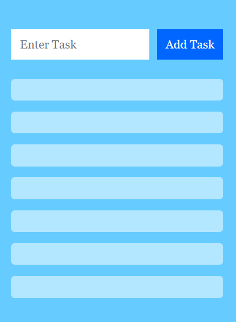

## React JS Todo App
This is a sample react todo app, This will allow you to create your Todo Task List and Delete once its completed. 

Check the demo hosted on https://rakeshrenukut.github.io/ToDo-ReactJSApp/ .

## Instructions

First clone this repository.

<pre><code>$ git clone https://github.com/rakeshrenukut/ToDo-ReactJSApp.git</code></pre>

Install dependencies. Make sure you already have nodejs & npm installed in your system.

<pre><code>$ npm install # or yarn</code></pre>

Run it

<pre><code>$ npm start # or yarn start</code></pre>

## Screenshot

